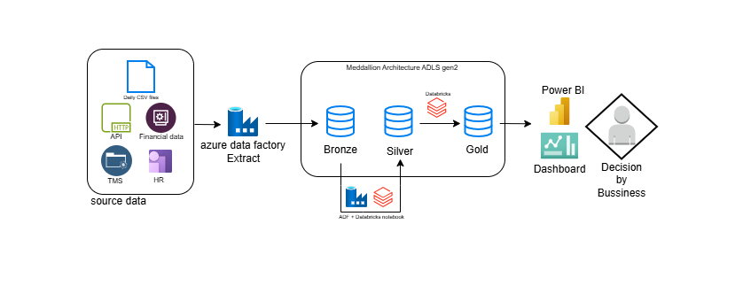

# Aastha-logistics-Azure-Data-Engineering-Project---Logistics
This project demonstrates the design and implementation of an end-to-end Data Engineering platform for a logistics company. The system integrates data from multiple heterogeneous sources including CSV files, HTTPS APIs, and on-premise TMS (Transport Management System).

The pipeline performs ELT/ETL operations using Azure services to transform raw data into business-ready datasets for Power BI dashboards and Machine Learning use cases.

Data Sources
Operational Data (Trip details, truck movement, fuel usage)
HR Data (Driver details, attendance, payroll)
Financial Data (Revenue, expenses, invoices)
CSV Files (Manual uploads from branches)
HTTPS APIs (External integrations)
On-Prem TMS System (Transport Management System database)

## Architecture Overview
# Logistics Data Engineering Project - End-to-End ELT Pipeline

## Architecture Diagram

Data Sources (CSV | HTTPS | On-Prem TMS | Financial)
        ↓
Azure Data Factory (Ingestion)
- Incremental Load
- CDC (Change Data Capture)
- Watermark Logic
        ↓
Raw Layer (Bronze - ADLS)
- Raw, unprocessed data
- Historical storage
        ↓
ADF + Databricks (Incremental Processing)
- Trigger Databricks Notebooks
- Incremental transformations
        ↓
Silver Layer
- Data cleaning
- Standardization
- Joins
        ↓
Gold Layer
- Data Modeling (Star Schema)
- SCD Type 1 & Type 2
- Aggregations
        ↓
Power BI
- Reporting
- Dashboards
- Business Insights

---

## Flow Summary

* Data is ingested using **ADF with incremental load, CDC, and watermark logic**
* Stored in **Bronze layer (raw data)**
* ADF triggers **Databricks notebooks for processing**
* Cleaned data moves to **Silver layer**
* Business transformations, **SCD1 & SCD2**, and modeling happen in **Gold layer**
* Final data is consumed by **Power BI for reporting**

1. Data Ingestion
Built pipelines in Azure Data Factory

Integrated:
On-prem TMS via Self-hosted Integration Runtime
APIs via HTTP connectors
CSV files shared via azure gen2 Storage container daily basis
Implemented parameterized pipelines and scheduling

2. Data Storage (Medallion Architecture)
Raw Layer → Stores original data
Clean Layer → Standardized & validated data
Curated Layer → Business-ready datasets

3. Data Transformation (ELT/ETL)
Used Azure Databricks (PySpark) for transformations:
Data cleaning (nulls, duplicates)
Schema standardization
Joins across operational, HR, and finance data
Aggregations & KPI calculations

4. Business Use Cases
Operational Analytics
Fleet utilization
Trip efficiency
Fuel consumption tracking

HR Analytics
Driver attendance & performance
Salary vs productivity

Financial Analytics
Revenue vs cost analysis
Profitability by route

Advanced Analytics (ML Ready) future usecase
Demand forecasting
Route optimization
Cost prediction

5. Reporting Layer
Built Power BI dashboards for:
      Real-time operational monitoring
      Financial performance tracking
      HR insights

## Key Features
Multi-source data integration
ELT + ETL hybrid processing
Medallion architecture
Scalable cloud-based solution
Supports BI + Machine Learning use cases
Automated and parameterized pipelines

## Skills Demonstrated
Azure Data Factory (ADF Pipelines, Integration Runtime)
Azure Databricks (PySpark)
Data Modeling & Transformation
SQL
Power BI
ELT/ETL Design
Cloud Data Engineering azure-ADf, synapse, databricks, powerbi

## Future Enhancements
Real-time streaming using Event Hub / Kafka
Incremental loading & CDC
CI/CD using Azure DevOps
Advanced ML pipelines integration
Data quality monitoring framework

## Author
Nandan Sadhu
